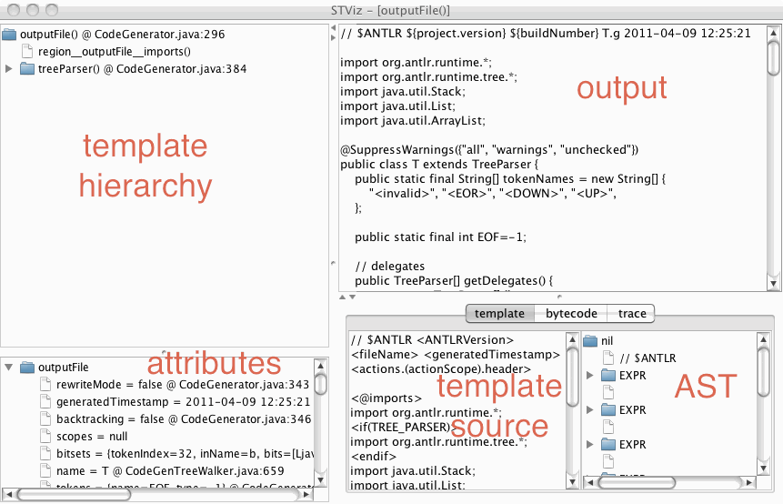
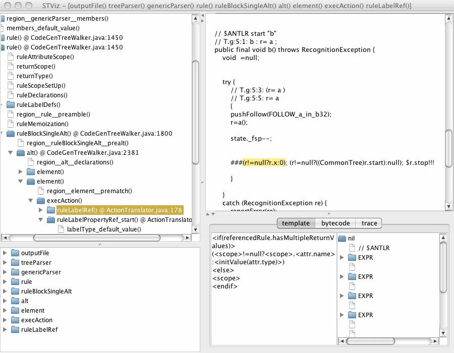
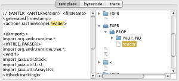
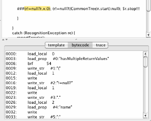
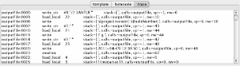
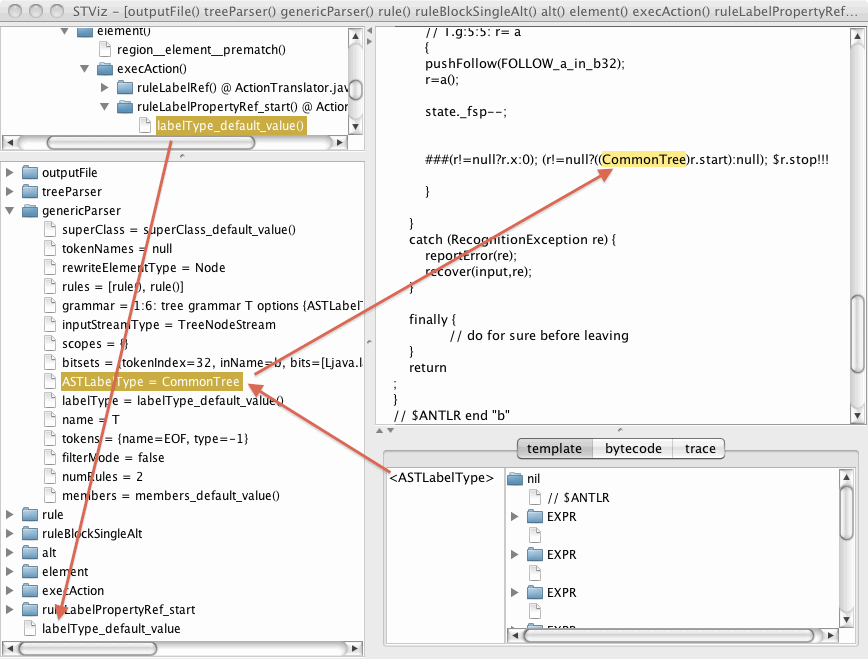

# StringTemplate Inspector GUI

One of the frustrations with ST v3 was that it was sometimes hard to debug the templates. For v4, everything is a lot cleaner and I can present for you a nice GUI that tells you everything about a template and any nested templates. There are some key bits of information you need when debugging a template:

* What template fragment emitted this output?
* What did this template fragment emit?
* What are the attributes associated with this template instance?
* What attributes are visible to a particular template?
* Where in the source code did I set an attribute?
* Where in the source code did I create this template?
* How is ST interpreting the syntax of my template?

The GUI frame answers these questions and provides extra information including the generated bytecodes compiled from the original template as well as an execution trace through the interpreter.

## How to launch the inspector

To use the GUI inspector, you don't need to do anything except call ST.inspect() on the root of your template hierarchy. If you also want to track template creation events and attribute injection events, turn on the static STGroup.trackCreationEvents flag. The interpretation of templates is totally side effect free so you can render and inspect templates as you wish and in any order.

```java
STGroup.trackCreationEvents = true;
STGroup group = new STGroupFile("t.stg");
ST st = group.getInstanceOf("test");
st.add("attrname", value);
...
st.inspect();
```

## Inspector window components

Here's basic view when you start up:


* tree of templates is the upper left pane
* attributes of the templates stack (path from selected template to the root of the total anarchy) are in the lower left pane
* error messages from the compiler or interpreter go in the bottommost pane
* the output is in the upper right pane
* one of three things is in the lower right pane:
  1. the template source code and the AST built by the ST compiler
  1. the byte codes compiled from that source
  1. the execution trace of the byte code interpreter.



### Clicking template in hierarchy shows related output

Clicking on one of the templates in the upper left quadrant resets the display so that the output from that template instance is highlighted in the output pane. The stack of templates in the lower left pane also changes. Opening up the template names in that pane shows the attributes injected into that template.

### Corresponding Java source code locations

Also notice that the location in the source code where the template was created to show and also the  place in the source where the  attribute was added is shown. The main outputFile template was created at location CodeGenerator.java line 296. In the attributes pane you can see that rewriteMode was injected at line 343, and so on. If there is no location, that means that the template was automatically created by StringTemplate internally or the attribute was not set.

### Clicking in output window shows which template emitted that text



### AST window shows how ST compiler interpreted template source

Sometimes it's helpful to figure out how ST interprets the syntax of your source code. When looking at the template source, the right subpane next to it shows the AST. If you click on an element in the AST, it highlights the place in the source code for which it was created.



### Displaying compiled ST bytecodes

If you'd like to see what the bytecode looks like, you can click on that pane.



### Displaying bytecode interpreter trace

Finally, you can also see the interpreter in action (mostly of educational value). The trace shows the stack of the byte code interpreter, the call stack, and the number of output characters.



### Dynamic scoping of attributes

When you reference an attribute, say, x within your template, ST tries to resolve x within the injected attributes of that template. If you can't find it, ST looks up the enclosing template change towards the root of the overall template hierarchy. This dynamic scoping allows deeply nested templates to refer to attributes injected into the root template. You might, for example, want to know the overall file name in some deeply nested template. Or, you might want to know the surrounding method name when you're generating code in nested template for the various statements.

Sometimes, though, it can be hard figuring out why an attribute as the wrong value. You can look at the lower left pane for the stack of templates to see the scope context. Simply start at the bottom and look upwards until you find the first definition of your attribute. Here's an example where the output shows "CommonTree" because the ruleLabelPropertyRef_start references attribute labelType:

```
(<scope>!=null?((<labelType>)<scope>.start):null)
```

`labelType` happens to be a default attribute of a template above in the hierarchy that references `ASTLabelType`. The `ASTLabelType` value is set as an argument of `genericParser` template way up the hierarchy, almost at the root.


